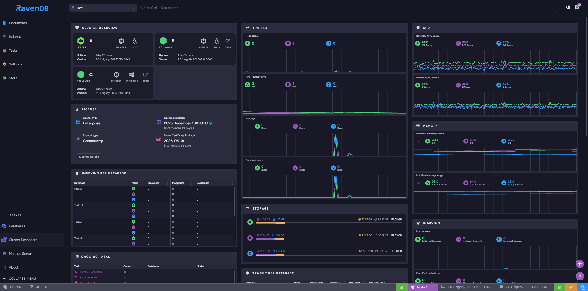

<h1 align="center">  

Modern ACID NoSQL Database</h1>

<h4 align="center">    
    <a href="https://discord.com/invite/ravendb">Discord 🌐💬🎙️</a> |
    <a href="https://github.com/ravendb/ravendb/discussions">Discusssions 🎫</a> |
    <a href="https://www.youtube.com/@ravendb_net">YouTube ▶️</a> 
      
    <a href="http://live-test.ravendb.net/">🔌 Try from your browser, now! 🔌</a>
      
    <a href="https://ravendb.net/docs">🎒👶 Documentation</a> |
    <a href="https://ravendb.net/articles">📰 Articles</a> | 
    <a href="https://ravendb.net/book"> Book 📖🍵 </a>
      
    <a href="https://ravendb.net/license/request/dev">💹💰 Free developer license </a>
      
</h4>

[RavenDB](https://ravendb.net/) is a NoSQL database forged in the flames of passion, by the people frustrated with the state of database industry. Fusing extreme performance and tranquility of ease-of-use, RavenDB offers **above-the-roof developer experience**. While we take the heavy lifting of managing your data (and a lot more..) on our shoulders, you can focus on your system and application code.

## We're 

- Completely open-source (AGPLv3)

- Fully ACID & Secure by default

- Equipped with state-of-art web UI

- Continuously growing for 15+ years

- Trusted by major Fortune500 companies 

- Supporting all major platforms - Linux, MacOS, Windows, Containers, Raspberry Pi

- Offering great on-premise experience and also a DBaaS solution - [RavenDB Cloud](https://ravendb.net/cloud)

- Growing [Developers Community](https://discord.com/invite/ravendb), hosting events and talks  

- Hosting booths at many major conferences - [take a look](https://ravendb.net/events) where to meet us

## Get your hands-on 🧑‍💻

#### Quick tryout 🔌
- Plug-in to RavenDB now - http://live-test.ravendb.net/

#### RavenDB Cloud ☁️
- Get your [free instance here](https://cloud.ravendb.net/pricing)

#### Linux, MacOS, Windows⚡
- [Download](https://ravendb.net/download), extract, and execute `run.sh`/`run.ps1`. 

#### Docker 🐳
- Start RavenDB container -  `docker run --rm -it ravendb/ravendb:latest -p 8080:8080`

#### .deb package 🐧
- Install with `apt`! Manual is here - [.deb installation guide](https://ravendb.net/docs/article-page/7.0/csharp/start/installation/gnu-linux/deb)

#### More details 🎒💿
- For advanced setup guide, visit [Getting Started](https://ravendb.net/docs/start/getting-started). For Studio manual, check [Overview](https://ravendb.net/docs/studio/overview). 

<h2 align="left">🏗️ SDKs </h2>
<h4 align="left">
    Official
      
    <a href="https://www.nuget.org/packages/RavenDB.Client/">.NET </a> |
    <a href="https://github.com/ravendb/ravendb-nodejs-client"> Node.JS </a> |
    <a href="https://github.com/ravendb/ravendb-python-client"> Python </a> |
    <a href="https://github.com/ravendb/ravendb-jvm-client"> Java  </a> |
    <a href="https://github.com/ravendb/ravendb-php-client"> PHP </a> |
    <a href="https://github.com/ravendb/ravendb-go-client"> Golang </a> |
    <a href="https://github.com/ravendb/ravendb-cpp-client"> C++ </a> |
    <a href="https://github.com/ravendb/ravendb-ruby-client"> Ruby </a> 
      
    Community
     
    <a href="https://github.com/YgorCastor/ravix"> Elixir </a>
      
</h4>

##  RavenDB Management Studio 🐦‍⬛

## Content & Learning 
- [RavenDB vs MongoDB: Check the full comparison](https://ravendb.net/ravendb-vs-mongodb)
- [RavenDB Book](https://ravendb.net/book) 💙
- [RavenDB Bootcamp](https://ravendb.net/learn/bootcamp):  fast, free, and self-directed learning course.
- [RavenDB Founder - Oren's Blog 💡](https://ayende.com/blog/)
- [RavenDB Official YouTube Channel](https://www.youtube.com/@ravendb_net)

## Contributing & releases 
- [Latest improvements](https://ravendb.net/docs/article-page/7.0/csharp/start/whats-new), updated weekly.
- [Contribution guidelines](./CONTRIBUTING.md) for both issues and PRs.

<h2 align="center">Hall of Fame 🏆</h2>

<h4 align="center"> Special thanks to all our contributors! </h4>

